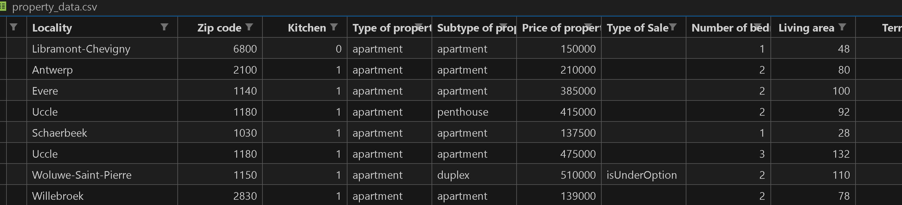
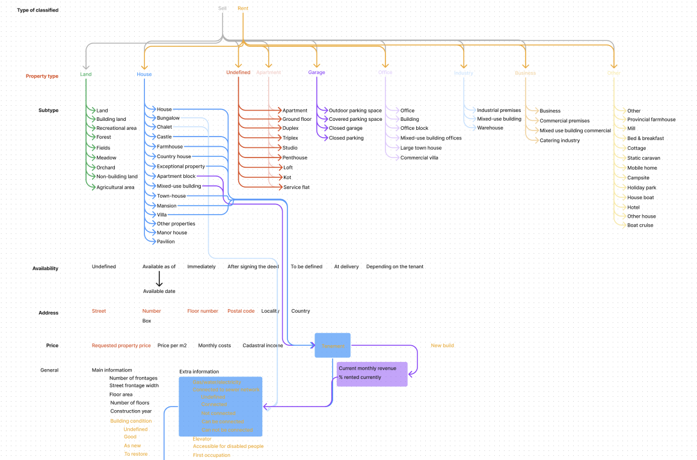

# challenge-collecting-data

## About
This is the first out of a four part study project to make a working data model that analyses the current Belgian housing market, and is able to predict House- and Apartment pricing accurately. Our dataset uses +10.000 listings.  

1. 'main()': Central operating module for our scraper. Calls necessary functions.
2. 'initialize_csv()': This function initializes a CSV file with the specified(read code) headers.
3. 'get_links()': This function retrieves the links for the property listings.
4. 'process_link()': This function processes a single property link. The steps involved in processing the link are:
    1. Fetching the page content using an HTTP GET request.
    2. Parsing the page content using BeautifulSoup.
    3. 'extract_relevant_data()': This function extracts the relevant data from the HTML content of a property listing page. 
    It uses the BeautifulSoup instance of the HTML content (`soup`) and the URL of the page (`url`) as inputs.
    After identifying and extracting the relevant data from the HTML content, the function packages the 
    data into a dictionary and returns it.
    4. 'write_to_csv()': This function writes the scraped data to the CSV file.
       1. Calls 'read_existing_listings()': Which reads the current state of the CSV file.
       2. 'is_duplicate_listing()': Is supposed to check for duplicate listings in the CSV file before appending new listing, but it is currently not functioning as intended.

## Installation and Requirements
Using Python 3.11 and 'pip install -m requirements.txt' to get all required packages to run.

## Usage
To run the code, simply open your command prompt(cmd), powershell or vscode terminal window and type "python data_scraper.py" or use the path to both the python.exe and the main.py file. That would look something like this:    

'c:/Users/Daniel/Documents/GitHub/Challenge-Data/.challenge_data_env/Scripts/python.exe c:/Users/Daniel/Documents/GitHub/Challenge-Data/data_scraper.py'   
   
To correctly run the data-collection program, you need to specify a number between 1 - 333(333 is the maximum value the website we use to scrape from can handle for page numbers). This will provide slightly less than 20.000 scraped listings.

## Timeline
Project 1(out of 4) was started on the 26th of June 2023, and completed on 30/06/2023.     

Overview of timeline:    
Day 1: Delagation of tasks; Oleksandr main code structure, Bram creates a flowchart for required parameters, Daniel looks into the page elements for extractable information.    
Day 2: Bram finishes up with flowchart and researches Concurrency for improvements in speed, Oleksandr extracts most required data from javascript dictionaries, Daniel creates code to grab the list of URLs that need to be scraped.     
Day 3: Bram starts work on duplication checking code, Oleksandr focuses on data extraction speed(concurrency/threading) + structuring the CSV file, Daniel troubleshoots problems. The whole group also discusses the project together to gain a better understanding of it.   
Day 4: Career coach day, no progress towards the data assignement project.   
Day 5: Bram continues work on duplication checking code, discussing with Coach and rest of team, Oleksandr cleans up code and improves structure with functions + more comments, Daniel troubleshoots code and other (merging)issues together with team + finishes up on README. Finishing touches: created a requirements.txt file for easy installation.

   

## Potential Improvements

- More scraped data       
- Fix broken duplicate checking code (use pandas instead)     
- Better interface (G)UI     
- Async requests for faster data extraction     
- Expand property data parameters  
- Safety check if user exceeds max value input
     

## Team
Credits for this project goes to:    

- Main Developer: [Oleksandr Tsepukh's LinkedIn](https://www.linkedin.com/in/oleksandr-tsepukh-ba4985279?)       
- Repository Manager: [Bram Michielsen's LinkedIn](https://www.linkedin.com/in/brammichielsen?)         
- Project Lead: [Daniel Bauwens's LinkedIn](https://www.linkedin.com/in/daniel-bauwens-5515a8256/?)       

